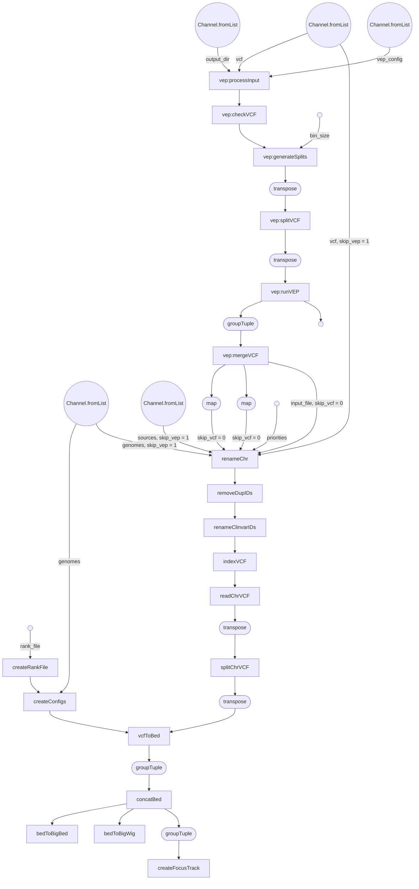

# ensembl-variation-pipelines

## Pre-requisite

### Repositories

Following repositories are needed for this pipeline - 

- `ensembl-variation`
- `ensembl-vep`

Make sure you have checked out to correct branch of these repositories.

### Python dependencies

The python dependencies are currently available in `variation-eva` pyenv environment. To have access to this environment please add these to your `.bashrc` - 

```
PYENV_ROOT="/hps/software/users/ensembl/variation/.pyenv"
if [[ -d "$PYENV_ROOT" ]]; then
    export PYENV_ROOT
    export PATH="$PYENV_ROOT/bin:$PATH"
    eval "$(pyenv init --path)"
    eval "$(pyenv init -)"
    eval "$(pyenv virtualenv-init -)"
fi
```

### Rust setup

These pipeline requires you can run rust executables. There is no Rust environment available in codon. You need to install using your codon user. Run the following command - 

```
curl https://sh.rustup.rs -sSf | sh
```

## Usage

Example command:

```
module add nextflow-22.10.1-gcc-11.2.0-ju5saqw

nextflow \
-C ${ENSEMBL_ROOT}/ensembl-variation-pipelines/nextflow/nf_config/nextflow.config \
  run ${ENSEMBL_ROOT}/ensembl-variation-pipelines/nextflow/workflows/vcf_prepper.nf \
  -profile lsf \
  --input_config <path/to/input_config.json> \
  --output_dir <path/to/output_dir> \
  --bin_size 250000 \
  --remove_patch 1 \
  --skip_vep 0 \
  --skip_create_config 0 \
  --ini_file <path/to/ini_file> \
  --rank_file <path/to/variation_consequnce_rank.json> \
  --version 108 \
  --rename_clinvar_ids 1 \
  -resume
```

## Options

- `input_config` : (optional) Give the full path of the input configuration file, default: `ensembl-variation-pipelines/nextflow/nf_config/input_sources.json`.

This is a json configuration file containing the source file information. You can specify the location of VCF files and also their priority in the config. The priority is used for generating focus track files. Variants from VCF file that have higher priority value will be stacked on top of variants from VCF file with lower priority value. e.g. - 

```
{
  "homo_sapiens_grch38" : [
    {
        "source_name": "dbSNP",
        "file_location": "/path/to/GCF_000001405.39_VEP.vcf.gz",
        "priority": 1
    },
    {
        "source_name": "GWAS",
        "file_location": "/path/to/input_gwas_catalog_v1.0.2-associations_e107_r2022-09-14_test.vcf.gz"
    }
  ]
}
```

In the above case, GWAS variants will be stacked on top of dbSNP variant. What it means is that, if GWAS and dbSNP both have a variant with name `rs100` only the variant from dbSNP will be kept. Priority is optional and by default it's value is 100. 

- `output_dir` : (optional) Give the full path of the dir where the outputs will be generated, default: `/nfs/production/flicek/ensembl/variation/new_website`

The generated VEP VCF and track files will be stored there. The directory structure would be - 

```
<output_dir>
  |
  -- <genome 1>
      |
      -- <source 1>
          |
          -- vcfs
              |
              -- *.vcf.gz
          -- tracks
              |
              -- *.bb
              -- *.bw
      -- <source 2>
      .
      .
      -- focus
          |
          -- vcfs
              |
              -- *.vcf.gz
          -- tracks
              |
              -- *.bb
              -- *.bw
  -- <genome 2>
  .
  .
```

- `bin_size` : (optional) This is a nextflow-vep pipeline parameter and determines the number of variants to split the VCF file by, default: `250000`.

- `remove_patch` : (optional) If value is 1, the pipeline will ignore sequence region with `PATCH`, `TEST`, `CTG` in name, default: `1`.

- `skip_vep` : (optional) If value is 1, the pipeline will skip running `nextflow-vep`, default: `0`. 

If `nextflow-vep` is skipped, the VCF file provided in the `input_config.json` should be VCF files that have already been run through VEP (with appropriate configuration required by vcf_prepper pipeline)

- `skip_create_config` : (optional) If value is 1, the pipeline will skip creating the config files, default: `0`.

The config files that falls under this condition are -

`synonyms files`: File containing sequence region synonyms and their original names in tab limited file created from Ensembl core database. Needed for `renameChr` step.

`chrom sizes files`: File containing sequence regions and their lengths in tab limited file. Used by UCSC tools to create bigWig and bogBeds.

- `ini_file` : (optional) A INI file that is used by the `createConfigs` step to generate the config files, default: `ensembl-variation-pipelines/nextflow/nf_config/DEFAULT.ini`.

The file format is -
```
[database]
host = <hostname>
port = <port>
user = <user>

[grch37_database]
host = <hostname>
port = <port>
user = <user>
```

Add the appropriate server information so that the core database related to the species and Ensembl version can be found. If `skip_create_config` is set to `1` this option is ignored.

- `rank_file` : (optional) Give the full path of the rank file to be generated and used, default: `ensembl-variation-pipelines/nextflow/nf_config/variation_consequnce_rank.json`

This rank file contains the rank of variant consequence and used to determine the most severe consequence of a variant. The pipeline generate this file automatically using Ensembl Variation api and later use it in the `vcfToBed` step.

Make sure you are checked out to appropriate `ensembl-variation` repository to get the appropriate ranks. ideally it would be the same version as provided by the `--version` parameter.

- `version` : (optional) Give the Ensembl version to be used, default: `108`.

Currently, used to get the appropriate Ensembl core database when creating the configs in `createConfigs` step.

- `rename_clinvar_ids`: (optional) If value is 1, the pipeline will try to convert id of the ClinVar VCF from ClinVar accession to ClinVar variant ID. 

## Pipeline Flow



Note: generated by `with-dag` param of nextflow. Needed some manual updates.