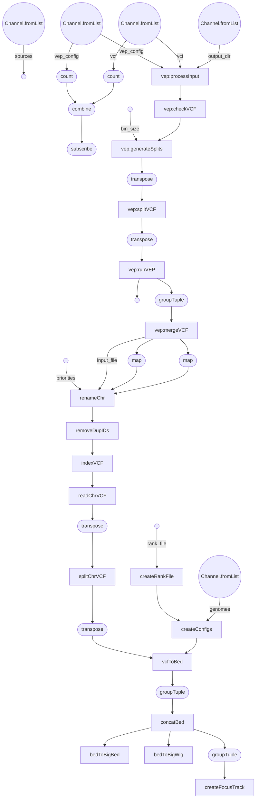

# ensembl-variation-pipelines

## pipeline flow

```mermaid
flowchart TD
    p0((Channel.fromList))
    p1((Channel.fromList))
    p2((Channel.fromList))
    p3((Channel.fromList))
    p4((Channel.fromList))
    p5(( ))
    p6(( ))
    p7[createRankFile]
    p8[createConfigs]
    p9([count])
    p10([count])
    p11([combine])
    p12([subscribe])
    p13[vep:processInput]
    p14[vep:checkVCF]
    p15(( ))
    p16[vep:generateSplits]
    p17([transpose])
    p18[vep:splitVCF]
    p19([transpose])
    p20[vep:runVEP]
    p21(( ))
    p22([groupTuple])
    p23[vep:mergeVCF]
    p24([map])
    p25([map])
    p26(( ))
    p27[renameChr]
    p28[removeDupIDs]
    p29[indexVCF]
    p30[readChrVCF]
    p31([transpose])
    p32[splitChrVCF]
    p33([transpose])
    p34[vcfToBed]
    p35([groupTuple])
    p36[concatBed]
    p37[bedToBigBed]
    p38[bedToBigWig]
    p39([groupTuple])
    p40[createFocusTrack]
    p0 -->|vcf| p9
    p1 -->|output_dir| p13
    p2 -->|vep_config| p10
    p3 -->|genomes| p8
    p4 -->|sources| p5
    p6 -->|rank_file| p7
    p7 --> p8
    p8 --> p34
    p9 --> p11
    p10 --> p11
    p11 --> p12
    p0 -->|vcf| p13
    p2 -->|vep_config| p13
    p13 --> p14
    p14 --> p16
    p15 -->|bin_size| p16
    p16 --> p17
    p17 --> p18
    p18 --> p19
    p19 --> p20
    p20 --> p22
    p20 --> p21
    p22 --> p23
    p23 --> p24
    p24 --> p27
    p23 --> p25
    p25 --> p27
    p23 -->|input_file| p27
    p26 -->|priorities| p27
    p27 --> p28
    p28 --> p29
    p29 --> p30
    p30 --> p31
    p31 --> p32
    p32 --> p33
    p33 --> p34
    p34 --> p35
    p35 --> p36
    p36 --> p37
    p36 --> p38
    p36 --> p39
    p39 --> p40
```
