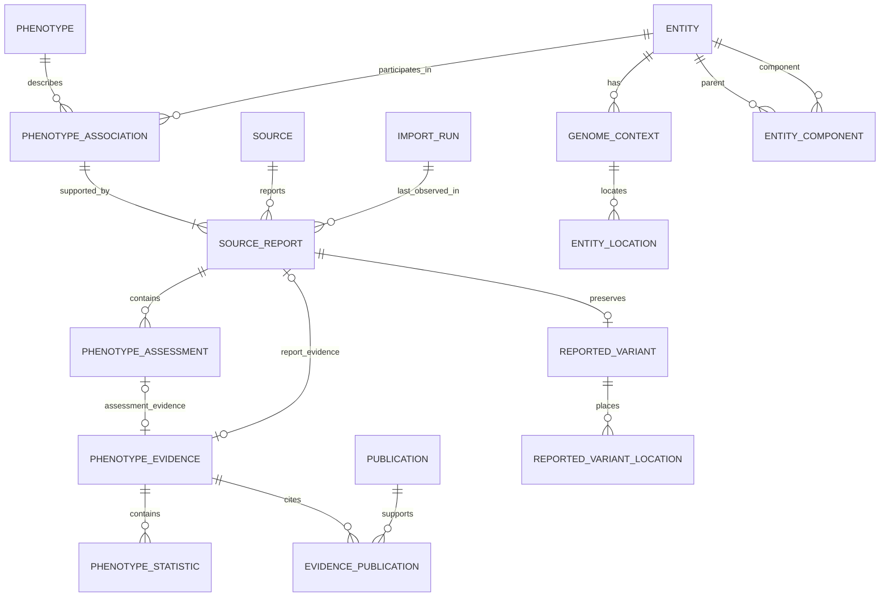

# Phenotype model to PostgreSQL table mapping

Status: implemented as [schema.sql](schema.sql), 2026-09-14. This document maps the scientific model to the first executable PostgreSQL schema. The model and schema can continue to evolve together.

Based on the phenotype model at commit `ee376ea683b8c46fc33e532cbd7e720a6d3e7c75` in the working-directory checkout of `variation-datastore-models`. The agreed scientific rules are recorded in `DECISIONS.md` in the working directory.

## Reading the mapping

- A primary key (PK) identifies a row. A foreign key (FK) points to an existing row in another table.
- Use singular snake_case table names. Most tables get a generated `BIGINT` PK named `<table>_id`. These are internal row IDs only, not public identifiers.
- The two optional one-to-one detail tables, `phenotype_measurement` and `reported_variant`, use their owner's ID as both PK and FK. The publication link table uses a two-column PK.
- Text fields use `TEXT`, including identifiers that currently look like UUIDs or numbers. The model has not restricted those strings to one identifier format.
- Simple string lists use `TEXT[] NOT NULL DEFAULT '{}'`. Preserve the model's empty-list meaning. The importer is responsible for supplying a flat list without null entries. Structured lists use related rows.
- Date-only values use `DATE`. This explicitly maps `ImportRun`'s date strings to typed dates; `ingestion_date` remains required.
- Statistics use `NUMERIC` without an arbitrary precision/scale limit. Keep `reported_value` as text so values such as `<1e-300` can be preserved without pretending the inequality is an exact value.
- Scalar nullability follows the model's field documentation. An absent optional detail object is represented by no detail row; an existing detail object with empty lists remains representable.
- All 20 model objects are represented. One additional link table gives 21 tables. The first ClinVar import does not need to populate every table.

## Reading the SQL rules

A constraint is a rule PostgreSQL checks when data is inserted, updated or deleted. The SQL uses the short forms below. PostgreSQL supplies constraint names automatically.

| SQL | Meaning | Example |
| --- | --- | --- |
| `PRIMARY KEY` | Identifies a row; must be unique and present. | `entity_id` |
| `NOT NULL` | A value is required. | A report must have a phenotype name. |
| `UNIQUE` | Prevents duplicate values, or duplicate combinations of values. | Two entities cannot have the same canonical identifier. |
| `REFERENCES` | Links to an existing row in another table; this is a foreign key. | An assessment points to its source report. |
| `CHECK` | Restricts allowed values or combinations. | Assessment level is aggregate, submission or null. |

For example, `source_id BIGINT NOT NULL REFERENCES source (source_id)` means every report needs a source ID that exists in the source table. `ON DELETE RESTRICT` prevents deleting a referenced parent; `ON DELETE CASCADE` removes owned child rows with their parent.

`CONSTRAINT some_name` is optional syntax for giving a rule a chosen name. The schema omits these explicit names to reduce repetition. Rules for one column sit beside that column where practical; rules involving several columns sit at the end of the table definition.

## Relationship overview

The diagram shows the central relationships. The tables below also cover ontology mappings, external references, reported variants, annotations and molecular measurements.



Each evidence row has exactly one owner: a report OR an assessment. The diagram's two optional relationships do not mean an evidence row can have both owners. The same exclusive-owner rule applies to annotations.

## Associations and provenance

Each table below has its generated PK in addition to the listed columns, unless stated otherwise.

| Model object → SQL table | Scalar columns | Foreign keys and relationships |
| --- | --- | --- |
| `PhenotypeAssociation` → `phenotype_association` | `somatic_status` | Required `phenotype_id` → `phenotype`; required `entity_id` → `entity`. Reports point back to the association. |
| `Phenotype` → `phenotype` | `name` | Optional `primary_ontology_term_id` → `ontology_term`. Its optional measurement points back to the phenotype. |
| `PhenotypeMeasurement` → `phenotype_measurement` | `measurement_type` | `phenotype_id` is the PK/FK → `phenotype`; required `measured_entity_id` → `entity`. At most one measurement per phenotype. |
| `SourceReport` → `source_report` | `source_accession`, `reported_phenotype_name`, `reported_genes TEXT[]`, `reported_allele`, `comparison_allele`, `allele_role`, `reported_relationship_type`, `reported_biological_context` | Required `phenotype_association_id`, `source_id`, `import_run_id` → their tables; optional `biological_context_id` → `ontology_term`. Child tables hold mappings, references, variant details, evidence, assessments and annotation. |
| `Source` → `source` | `name`, `description`, `url` | Shared by its reports. |
| `ImportRun` → `import_run` | `source_version`, `download_url`, `download_date DATE`, `ingestion_date DATE`, `pipeline_version` | Reports refer to the latest successful run that produced or observed them. Do not add a duplicate source field to this model object. |
| `ReportedVariant` → `reported_variant` | `identifier`, `variant_type`, `structural_attributes JSONB` | `source_report_id` is the PK/FK → `source_report`. At most one reported variant per report. Source locations point back to it and hold assembly and allele values; these are not repeated on the reported variant. |
| `ReportedVariantLocation` → `reported_variant_location` | `assembly`, `assembly_accession`, `assembly_status`, `chromosome`, `sequence_accession`, `start`, `stop`, `display_start`, `display_stop`, `outer_start`, `inner_start`, `inner_stop`, `outer_stop`, `position_vcf`, `reference_allele_vcf`, `alternate_allele_vcf`, `variant_length`, `strand` | Required `source_report_id` → `reported_variant`. All source-value columns are nullable. Coordinate and length columns are `BIGINT`; other columns are `TEXT`. |

Example: a single variant–phenotype association can have several source reports. An assessment row points to one of those reports, so its provenance is not inferred from the association as a whole. Germline and somatic assertions belong to different associations.

A measured gene or transcript is an `entity` row. If it omits genome context, no artificial genome-context row is created; the model's inherited context is interpreted through the containing association.

### Unmatched variants and source coordinates

Ensembl matching controls the link to an entity page, not inclusion in the explorer dataset. Supported unmatched associations retain a source entity and `reported_variant` details. A missing match must not require fabricated canonical coordinates or a fabricated `genome_uuid`. Resolution status and the confirmed website identifier still need a database mapping when the resolver is implemented.

`reported_variant_location` stores source placements separately from resolved `entity_location` rows. Several placements can belong to one report, for example X and Y. The parser retains only the requested assembly and uses the existing NC-over-NW preference. Missing exact `start`/`stop` values remain null; display coordinates and inner/outer bounds are preserved separately. VCF alleles belong to `position_vcf`, not necessarily to the interval `start`. Source coordinates use one-based positions. The importer handles validation; this table deliberately adds no coordinate checks that would discard incomplete source records.

`structural_attributes` is a small JSON object containing source copy-number or cytogenetic values, for example `{"AbsoluteCopyNumber": ["1"]}`. Values remain strings and repeated values form lists. The importer supplies an object with this shape. This preserves source information without introducing a separate table for each structural-variant attribute; it does not claim to interpret breakends or complex rearrangements.

## Entities and locations

| Model object → SQL table | Scalar columns | Foreign keys and relationships |
| --- | --- | --- |
| `Entity` → `entity` | `identifier`, `type`, `label` | Referenced by associations, measurements and component relationships. Contexts and components point back to it. |
| `EntityComponent` → `entity_component` | `allele`, `ordinal INTEGER` | Required `parent_entity_id` → `entity`; required `component_entity_id` → `entity`. The latter represents the model field `EntityComponent.entity`. |
| `GenomeContext` → `genome_context` | `species_taxon_id INTEGER`, `species_scientific_name`, `organism_id`, `organism_display_name`, `genome_uuid` | Required `entity_id` → `entity`. Context rows are owned by an entity; source coordinates are stored separately under reported variants. |
| `EntityLocation` → `entity_location` | `seq_region_name`, `seq_region_start BIGINT`, `seq_region_end BIGINT`, `seq_region_strand INTEGER`, `reference_allele`, `alternate_alleles TEXT[]` | Required `genome_context_id` → `genome_context`. |

Example: one entity has a GRCh37 context and a GRCh38 context. Each context has its own locations, while the association still points to the same assembly-independent entity.

For a haplotype, `entity_component` records parent, component, allele and optional order. Do not attach the haplotype's evidence to its component entities.

## Ontologies and external references

| Model object → SQL table | Scalar columns | Foreign keys and relationships |
| --- | --- | --- |
| `OntologyTerm` → `ontology_term` | `accession`, `label`, `source`, `url` | Shared by primary phenotype terms, report mappings and biological contexts. |
| `PhenotypeOntologyMapping` → `phenotype_ontology_mapping` | `mapping_method` | Required `source_report_id` → `source_report`; required `ontology_term_id` → `ontology_term`. The method belongs to this relationship. |
| `ExternalReference` → `external_reference` | `accession`, `database`, `reference_subject`, `url` | Required `source_report_id` → `source_report`. These references remain report-owned, distinct from ontology mappings. |

Example: two reports may map to the same ontology term using different methods. They share an ontology-term row but have separate mapping rows. This does not establish a new cross-source grouping policy.

## Assessments, evidence and annotations

| Model object → SQL table | Scalar columns | Foreign keys and relationships |
| --- | --- | --- |
| `PhenotypeAssessment` → `phenotype_assessment` | `assessment_type`, `assessment_value`, `assessment_level`, `review_status`, `last_evaluated_date DATE`, `source_accession`, `submitters TEXT[]` | Required `source_report_id` → `source_report`. Optional evidence and annotation point back to the assessment. |
| `PhenotypeEvidence` → `phenotype_evidence` | `ega_accessions TEXT[]` | Nullable `source_report_id` and `phenotype_assessment_id` → their tables. Exactly one is non-null. Each owner column is individually unique, allowing at most one evidence bundle per owner. Statistics and publication links point to this evidence row. |
| `PhenotypeStatistic` → `phenotype_statistic` | `statistic_type`, `value NUMERIC`, `unit`, `direction`, `reported_value` | Required `phenotype_evidence_id` → `phenotype_evidence`. |
| `Publication` → `publication` | `identifier`, `source`, `url` | Shared by evidence bundles through `evidence_publication`. |
| Link table → `evidence_publication` | No additional scalar columns | Required `phenotype_evidence_id` and `publication_id` are FKs and together form the PK. |
| `PhenotypeAnnotation` → `phenotype_annotation` | `inheritance_types TEXT[]`, `disease_mechanism`, `allelic_requirement`, `variation_consequence` | Nullable `source_report_id` and `phenotype_assessment_id`, with exactly one non-null. Each owner column is individually unique. |

### Why each evidence or annotation row has one owner

An owner is the report or assessment that a particular evidence or annotation bundle describes. Each bundle belongs to exactly one owner, even when another bundle happens to contain identical information. This makes it clear which evidence supports which judgement.

For example, suppose ClinVar report 10 contains assessment 101 from Laboratory A, which says **pathogenic**, and assessment 102 from Laboratory B, which says **uncertain significance**. The following IDs and publications are illustrative:

| Evidence row | `source_report_id` | `phenotype_assessment_id` | Publications linked to this evidence |
| --- | --- | --- | --- |
| 1 | null | 101 (Laboratory A) | PMID:123 |
| 2 | null | 102 (Laboratory B) | PMID:123, PMID:456 |
| 3 | 10 | null | PMID:789, if supplied as evidence for the whole report |

PMID:123 is stored once in `publication`. Two rows in `evidence_publication` link it to evidence rows 1 and 2. The publication is shared, but the evidence bundles remain separate. Evidence 1 cannot itself belong to both assessments: its owner is the single assessment recorded in `phenotype_assessment_id`.

Even if both laboratories cited exactly the same publications, each assessment would still have its own evidence row and publication links. Changes to one assessment's evidence would then leave the other assessment's evidence intact. Report-level evidence is stored separately; the schema does not automatically copy it into every assessment or combine assessment evidence into report-level evidence.

### How the SQL enforces this

Both `phenotype_evidence` and `phenotype_annotation` contain:

```sql
CHECK (
    (source_report_id IS NOT NULL) <> (phenotype_assessment_id IS NOT NULL)
)
```

Each `IS NOT NULL` expression is true when that owner ID is supplied. `<>` means “not equal”, so the check requires one expression to be true and the other false:

| Report ID supplied? | Assessment ID supplied? | Result |
| --- | --- | --- |
| Yes | No | Allowed: belongs to the report. |
| No | Yes | Allowed: belongs to the assessment. |
| Yes | Yes | Rejected: the bundle would have two owners. |
| No | No | Rejected: the bundle would have no owner. |

For evidence belonging to assessment 101, leave `source_report_id` null even though that assessment belongs to report 10. The report can already be reached through the assessment; filling both columns would incorrectly describe two direct owners.

The foreign keys require the chosen owner to exist. The separate `UNIQUE` rules on the two owner columns ensure that each report or assessment has at most one evidence bundle and at most one annotation bundle. PostgreSQL permits multiple nulls in these unique columns, so different assessments can each have evidence while their evidence rows' `source_report_id` values are all null. A report or assessment may have no evidence or annotation: in that case, no corresponding bundle row is created.

### The same rule for annotations

Suppose both laboratories report **Autosomal dominant inheritance**. Each assessment gets its own `phenotype_annotation` row containing that value in `inheritance_types`, linked to assessment 101 or 102 respectively. Identical annotation text does not make it a shared assertion. A report-level annotation, when supplied, gets a separate row linked only to report 10. The array preserves multiple modes reported for one assertion.

This ownership policy is the physical SQL interpretation used for the model's report-level and assessment-level bundles. It preserves their separate provenance without adding a shared-bundle relationship to the model.

## Keys and constraints

These physical rules are implemented in `schema.sql`. They do not implement cross-source matching.

| Area | Implemented rule |
| --- | --- |
| Shared identifiers | Unique `entity.identifier`, `source.name`, `ontology_term.accession` and `publication(source, identifier)`. Ontology accessions must carry their namespace. |
| Association identity | Unique `(entity_id, phenotype_id, somatic_status)`. This prevents duplicate links to the same existing phenotype row; it does not decide whether two phenotype rows mean the same thing. |
| Phenotype labels | Do not make `phenotype.name` unique. Identical free text does not establish identity. Do not add cross-source ontology/measurement grouping constraints in this draft. |
| Source accessions | Neither report nor assessment accession is globally unique. Split reports, multiple assessment types and versions must remain representable. |
| Somatic status | Required; `germline`, `somatic`, or `unspecified` when the source does not establish either context. Unspecified is not a mixed germline/somatic assertion and remains a separate association context. |
| Assessment level | Optional; only `aggregate` or `submission` when present. |
| Reference subject | Required; only `entity` or `phenotype`. |
| Extensible categories | Keep assessment type, assessment value, entity type, measurement type, mapping method, statistic type and annotation values as text. Examples in the model are not automatically exhaustive vocabularies. |
| Coordinates | Require `start >= 1` and `end >= 0`; allow an inclusive interval or the insertion exception `start = end + 1`. An insertion before the first base can have `start=1, end=0`. Use only `-1`, `1` or null for strand. |
| Entity components | Reject direct self-containment; require positive ordinals when supplied, unique per parent. Indirect cycles require an additional check outside ordinary row constraints. |
| Optional detail ownership | Measurement and reported-variant PKs enforce one per owner; evidence and annotation use the exclusive-owner constraints described above. |
| Arrays | Empty arrays represent no entries and the array column itself cannot be null. The importer must provide a one-dimensional array without null elements and preserve the intended order. |

Foreign keys alone cannot enforce every model rule. The loader's validation before committing must ensure each association has at least one report; that free-text-only associations remain single-report as the model requires; that component graphs are acyclic; and that contextual scientific rules hold, including statistic direction/sign agreement and focal-allele consistency when a complete representation exists. These checks remain required even where ordinary SQL constraints cannot express them. A trigger-based alternative can be considered when the writer/concurrency design is known.

Coordinate checks do not establish a policy for encoding empty alleles versus missing information; that remains an explicit open item.

## Ownership, deletion and indexes

Use cascading deletion only for owned details:

- Association → reports → assessments, mappings, external references and reported variant.
- Reported variant → its reported locations.
- Report or assessment → owned evidence and annotation.
- Evidence → statistics and publication links.
- Phenotype → measurement.
- Entity → its genome contexts → locations, and its outgoing component relationships.

Restrict deletion of shared referenced rows: entities used by associations or measurements, entities used as components by other parents, phenotypes used by associations, ontology terms, sources, import runs and publications still in use. Removing a report must not remove a shared phenotype, entity, ontology term or publication. Unreferenced shared-row cleanup is a separate operation.

Index the referencing FK columns for joins and deletion checks, avoiding redundant indexes already supplied by PK/unique constraints. Add non-unique indexes on `source_report(source_id, source_accession)` and assessment `source_accession` for provenance lookup. Defer extra array and genomic-range indexes until query examples establish the need.

## Applying the schema

`schema.sql` requires PostgreSQL 10 or later for identity columns; it was tested on PostgreSQL 16.2. It requires no extensions. Confirm the actual server version before deployment; the local `psql` client version is not the server version.

The file creates tables in the schema selected by the caller. It does not create a database or namespace, set credentials, or choose the production target. Use an existing empty target schema with appropriate privileges. From the pipeline project directory, the following is a template: replace the example connection service and schema name with the supplied target details.

```bash
psql -X --set=ON_ERROR_STOP=1 --dbname='service=phenotypes' \
  --command='SET search_path TO phenotypes' --file=sql/schema.sql
```

The script owns its `BEGIN`/`COMMIT` transaction. Do not wrap it in another transaction or pass `--single-transaction`. With stop-on-error enabled, a failure leaves no partially created schema. Reapplying it to existing tables fails explicitly; there are no `IF NOT EXISTS` clauses concealing mismatches. Destructive reset/drop operations remain a separate, future workflow.

## Validation

[tests/schema_smoke.sql](tests/schema_smoke.sql) exercises all 20 tables with a small fixture graph. Run it only in a disposable test schema after applying `schema.sql` there, using the same connection and search-path pattern as above. Fixture rows are rolled back, but generated ID sequences can advance even after rollback.

Checks cover valid insertions and maximum BIGINT coordinates, two assembly contexts, all three ClinVar classification types, repeated source accessions, aggregate/submission/null assessment levels, dates, exact small numeric values, shared publications, and evidence provenance. Negative cases cover missing FK targets, invalid levels and coordinates, null array columns, invalid evidence/annotation ownership, duplicate one-to-one details, and direct self-containment. Array shape and null-element validation now belongs to the importer. Deletion checks verify that owned report details cascade while shared data and unrelated reports survive.

On 2026-09-14 these tests passed using PostgreSQL 16.2 in an isolated temporary instance. Additional creation tests confirmed that rerunning the schema fails without changing existing tables and that a conflict at the final table rolls back all earlier DDL while preserving a pre-existing sentinel row. The command-line test runner exited successfully and the temporary server was stopped. No production database was contacted and project dependencies were not changed.

Graph-level loader checks listed above remain to be implemented with the importer; this SQL does not claim to enforce them.

## Still open

- PostgreSQL server version and schema namespace.
- ClinVar report matching and source refresh/retry policy. Generated row IDs do not prevent importing the same report twice; a source-aware key or replacement strategy must be designed with the importer.
- Exact combined-condition representation and empty-allele encoding.
- Lookup normalisation, cross-source grouping and future packaging of SQL for installed-only use, at their agreed later stages.

References: [PostgreSQL constraints](https://www.postgresql.org/docs/current/ddl-constraints.html), [PostgreSQL arrays](https://www.postgresql.org/docs/current/arrays.html).
