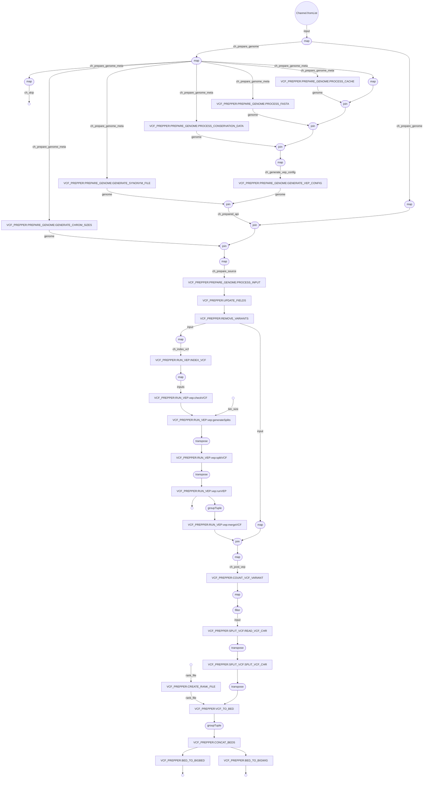

# vcf_prepper

Generates and process data required for the new Ensembl website.

## Pre-requisite

### Repositories

Following repositories are needed for this pipeline - 

- `ensembl-variation`
- `ensembl-vep`

Make sure you have checked out to correct branch of these repositories.

### Python dependencies

The python dependencies are currently available in `variation-eva` pyenv environment. To have access to this environment please add these to your `.bashrc` - 

```
PYENV_ROOT="/hps/software/users/ensembl/variation/.pyenv"
if [[ -d "$PYENV_ROOT" ]]; then
    export PYENV_ROOT
    export PATH="$PYENV_ROOT/bin:$PATH"
    eval "$(pyenv init --path)"
    eval "$(pyenv init -)"
    eval "$(pyenv virtualenv-init -)"
fi
```

### Rust setup

These pipeline requires you can run rust executables. There is no Rust environment available in codon. You need to install using your codon user. Run the following command - 

```
curl https://sh.rustup.rs -sSf | sh
```

## Usage

Example command:

```
module add nextflow-22.10.1-gcc-11.2.0-ju5saqw

nextflow \
run ${ENSEMBL_ROOT}/ensembl-variation-pipelines/nextflow/vcf_prepper \
  -profile lsf \
  --version 110 \
  --input_config <path/to/input_config.json> \
  --output_dir <path/to/output_dir> \
  --bin_size 250000 \
  --remove_nonunique_ids 1 \
  --remove_patch_regions 1 \
  --ini_file <path/to/ini_file> \
  --repo_dir ${repo_dir} \
  --skip_vep 0 \
  --skip_tracks 0 \
  --force_create_config ${force_create_config} \
  --rename_clinvar_ids 1 \
  --cache_dir ${cache_dir} \
  --fasta_dir ${fasta_dir} \
  --conservation_data_dir ${conservation_data_dir} \
  --rank_file <path/to/variation_consequnce_rank.json> \
  -resume
```

## Options

- `version` : (optional) Give the Ensembl version to be used, default: `108`.

Used to get the appropriate Ensembl core database when creating/processing configs.

- `input_config` : (optional) Give the full path of the input configuration file, default: `ensembl-variation-pipelines/nextflow/nf_config/input_sources.json`.

This is a json configuration file containing the source file information. You have to specify the location of VCF files and file type (local or remote). You will also need to give the genome uuid for the species and assembly. The species name is the species_production_name and assembly is the assembly_default value from core database. 

```
{
  "homo_sapiens_GRCh38" : [
    {
        "genome_uuid": "12345678-90ab-cdef-ghij-klmnopqrstuv",
        "species": "homo_sapiens",
        "assembly": "GRCh38",
        "source_name": "dbSNP",
        "file_location": "/path/to/GCF_000001405.39_VEP.vcf.gz",
        "file_type": "local"
    }
  ]
}
```

- `output_dir` : (optional) Give the full path of the dir where the outputs will be generated, default: `/nfs/production/flicek/ensembl/variation/new_website`

The generated VEP VCF and track files will be stored there. The directory structure would be - 

```
<output_dir>
  |
  -- api
      |
      -- <genome uuid 1>
          |
          -- variation.vcf.gz
          -- variation.vcf.gz.tbi
      -- <genome uuid 1> 
          |
          -- variation.vcf.gz
          -- variation.vcf.gz.tbi
      .
      .
  -- tracks
      |
      -- <genome uuid 1>
          |
          -- variant-dbsnp-details.bb
          -- variant-dbsnp-summary.bw
          -- variant-details.bb -> variant-dbsnp-details.bb
          -- variant-details.bb -> variant-dbsnp-details.bb
      -- <genome uuid 2>
          |
          -- variant-eva-details.bb
          -- variant-eva-summary.bw
          -- variant-details.bb -> variant-eva-details.bb
          -- variant-details.bb -> variant-eva-details.bb
  .
  .
```

- `bin_size` : (optional) This is a nextflow-vep pipeline parameter and determines the number of variants to split the VCF file by, default: `250000`.

- `remove_nonunique_ids` : (optional) If value is 1, the pipeline will ignore duplicate variants with same variant name, default: `1`.

- `remove_patch_regions` : (optional) If value is 1, the pipeline will ignore sequence region with `PATCH`, `TEST`, `CTG` in name, default: `1`.

- `ini_file` : (optional) A INI file that is used by the `createConfigs` step to generate the config files, default: `ensembl-variation-pipelines/nextflow/nf_config/DEFAULT.ini`.

The file format is -
```
[core]
host = <hostname>
port = <port>
user = <user>

[metadata]
host = <hostname>
port = <port>
user = <user>
```

Add the appropriate server information so that the core database related to the species and Ensembl version can be found.

- `repo_dir` : (optional) the location of the Ensembl repositories, default: `/hps/software/users/ensembl/repositories/${USER}`. 

- `skip_vep` : (optional) If value is 1, the pipeline will skip running `nextflow-vep`, default: `0`. 

If `nextflow-vep` is skipped, the VCF file provided in the `input_config.json` should be VCF files that have already been run through VEP (with appropriate configuration required by vcf_prepper pipeline)

- `skip_tracks` : (optional) If value is 1, the pipeline will skip creating track files. 

- `force_create_config` : (optional) If value is 1, the pipeline will forcefully create/process the config files even if they exist, default: `0`.

Config files include - FASTA, Ensembl VEP cache files, Conservation plugin data files, VEP config files, chromosome synonym file, and chromosome size files.

- `rename_clinvar_ids`: (optional) If value is 1, the pipeline will try to convert id of the ClinVar VCF from ClinVar accession to ClinVar variant ID. 

- `cache_dir` : (optional) Give the full path of the directory where VEP cache should be created if does not exist, default: `/nfs/production/flicek/ensembl/variation/data/VEP/tabixconverted`

For human GRCh38 and GRCh37 the default value cannot be overriden using this parameter.

- `fasta_dir` : (optional) Give the full path of the directory where FASTA file should be created if does not exist, default: `/nfs/production/flicek/ensembl/variation/data/VEP/fasta`

For human GRCh38 and GRCh37 the default value cannot be overriden using this parameter.

- `conservation_data_dir` : (optional) Give the full path of the directory where Conservation plugin data file should be created if does not exist, default: `/nfs/production/flicek/ensembl/variation/data/Conservation`

For human GRCh38 and GRCh37 the default value cannot be overriden using this parameter.

- `rank_file` : (optional) Give the full path of the rank file to be generated and used, default: `ensembl-variation-pipelines/nextflow/vcf_prepper/assets/variation_consequnce_rank.json`

This rank file contains the rank of variant consequence and used to determine the most severe consequence of a variant. The pipeline generate this file automatically using Ensembl Variation api and later use it in the `vcfToBed` step.

Make sure you are checked out to appropriate `ensembl-variation` repository to get the appropriate ranks. ideally it would be the same version as provided by the `--version` parameter.

## Pipeline Flow



Note: generated by `with-dag` param of nextflow.